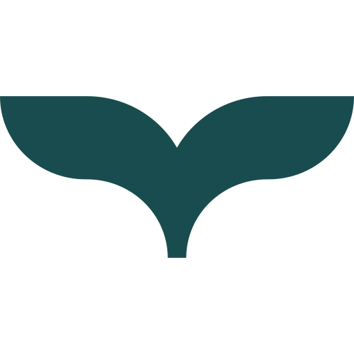

  <picture>
    <source media="(prefers-color-scheme: dark)" srcset="./assets/orca-mark-dark.svg">
    
  </picture>

<h1 align="center">Orca</h1>

<strong>The open runtime for managed agents</strong>

Orca is an open, declarative runtime for managed agents: declare an agent, and Orca runs it in sessions on infrastructure you operate, with the harness, model and sandbox you choose. It's compatible with Anthropic's Managed Agents API.

  <a href="https://runorca.ai">Website</a>
  ·
  <a href="https://github.com/orca-ae/orca-agent-engine#quick-start">Get started</a>
  ·
  <a href="https://github.com/orca-ae/orca-agent-engine/discussions">Discussions</a>
  ·
  <a href="https://github.com/orca-ae/orca-agent-engine/blob/main/CONTRIBUTING.md">Contribute</a>

<em>Orca is a developer preview. Come build with us.</em>

---

## Projects

### Core runtime

| Project | What it is | Get started |
|---|---|---|
| [Orca Agent Engine](https://github.com/orca-ae/orca-agent-engine) | The declarative runtime: the Anthropic-compatible Managed Agents API, the harness runtime that runs each session's agent loop, and pluggable sandboxes. Developer preview, 0.5.x | [Quick start](https://github.com/orca-ae/orca-agent-engine#quick-start), and images on `ghcr.io/orca-ae` |

### CLI and SDKs

| Project | What it is | Install |
|---|---|---|
| [`ork` CLI](https://github.com/orca-ae/homebrew-tap) | Command-line client for Orca Agent Engine | `brew install orca-ae/tap/ork` |
| [Go SDK](https://github.com/orca-ae/orca-sdk-go) | Go client for Orca Agent Engine | `go get github.com/orca-ae/orca-sdk-go` |
| [Python SDK](https://github.com/orca-ae/orca-sdk-python) | Python client for Orca Agent Engine | `pip install runorca` |
| [TypeScript SDK](https://www.npmjs.com/package/@runorca/orca-sdk) | TypeScript client for Orca Agent Engine | `npm install @runorca/orca-sdk` |

The `ork` CLI and the TypeScript SDK ship as Apache-2.0 binaries and packages, but their source isn't public. Report issues with them on [Orca Agent Engine](https://github.com/orca-ae/orca-agent-engine/issues).

### Skills and cookbooks

| Project | What it is | Get started |
|---|---|---|
| [Skills](https://github.com/orca-ae/orca-skills) | Agent Skills that teach a coding agent to build on Orca | In Claude Code: `/plugin marketplace add orca-ae/orca-skills` |
| [Cookbooks](https://github.com/orca-ae/orca-cookbooks) | Runnable recipes: small, complete programs built on the TypeScript SDK | Clone the repository |

## Get involved

- **Ask questions and share ideas** in [Discussions](https://github.com/orca-ae/orca-agent-engine/discussions).
- **Report bugs and request features** as [issues](https://github.com/orca-ae/orca-agent-engine/issues) on Orca Agent Engine, or on the repository they concern.
- **Propose a design** before you build something large. Orca Agent Engine records designs as Orca Improvement Proposals (OIPs): an OIP starts as an idea in Discussions and becomes a pull request. [`proposals/`](https://github.com/orca-ae/orca-agent-engine/blob/main/proposals/README.md) explains when you need one.
- **Send pull requests.** The [contributing guide](https://github.com/orca-ae/orca-agent-engine/blob/main/CONTRIBUTING.md) covers the workflow. Sign off every commit with `git commit -s` ([Developer Certificate of Origin](https://developercertificate.org/)); there's no CLA. If an AI tool helped, add an `Assisted-by:` trailer, as the [AI policy](https://github.com/orca-ae/orca-agent-engine/blob/main/AI_POLICY.md) describes.

Decisions happen in public, on the issue, pull request or discussion they concern. [GOVERNANCE.md](https://github.com/orca-ae/orca-agent-engine/blob/main/GOVERNANCE.md) describes how the maintainers work.

## Conduct and security

Everyone taking part in Orca follows the [code of conduct](https://github.com/orca-ae/.github/blob/main/CODE_OF_CONDUCT.md), which adopts the Contributor Covenant 3.0. Report a problem to **conduct@runorca.ai**.

Please don't report a vulnerability in a public issue. Report it privately from the Security tab of the affected repository, or email **security@runorca.ai**. The [security policy](https://github.com/orca-ae/.github/blob/main/SECURITY.md) has the details.

---

*Orca's projects and published artifacts are licensed under the [Apache License 2.0](https://www.apache.org/licenses/LICENSE-2.0).*

*Anthropic and Claude are trademarks of Anthropic, PBC. Orca isn't affiliated with or endorsed by Anthropic.*
